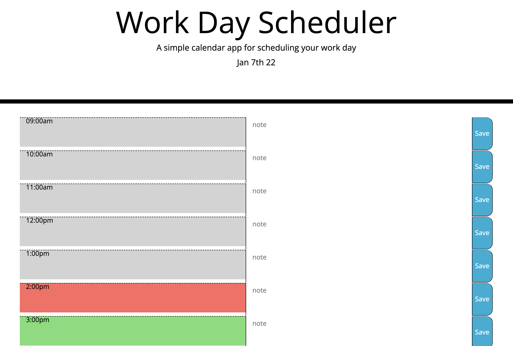

# Day Planner
live site: https://425megs.github.io/planner/ 
repo: https://github.com/425megs/planner

## User Story

AS AN employee with a busy schedule  
I WANT to add important events to a daily planner  
SO THAT I can manage my time effectively

A simple calendar application that allows a user to save events for each hour of the day. The calendar will display the current day for the user as well as highlight the current hour. The text within each timeblock can be edited as often as needed.

## Acceptance Criteria
WHEN I view the timeblocks for that day
THEN each timeblock is color coded to indicate whether it is in the past, present, or future
WHEN I click the save button for that timeblock
THEN the text for that event is saved in local storage
WHEN I refresh the page
THEN the saved events persist

  * Uses a date utility library to work with date and time

- - -
© 2021 Trilogy Education Services, LLC, a 2U, Inc. brand. Confidential and Proprietary. All Rights Reserved.
